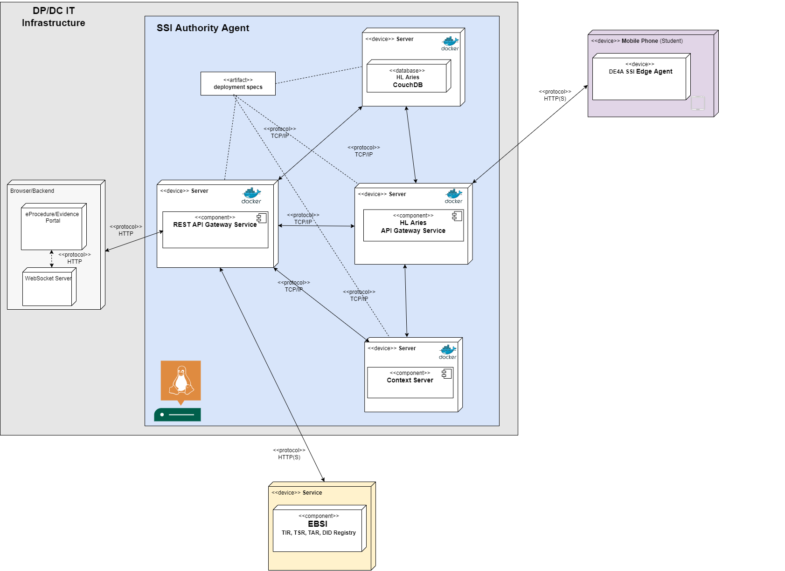

# DE4A Authority Agent

This project contains files and scripts for deploying the DE4A SSI Authority Agent. The Agent's implementation is based on open-source project Hyperledger Aries Go: https://github.com/hyperledger/aries-framework-go.

## Requirements (installation of tools for Linux)

-   Linux server (scripts were not tested on other OSes).
-   Git.
-   Docker (20.10.2): for Debian based installations of Linux (e.g. Ubuntu) installation instructions for Docker can be found [here](https://docs.docker.com/engine/install/ubuntu/) and for Fedora [here](https://docs.docker.com/engine/install/fedora/).
-   Docker Compose (1.27.4): for Debian distributions installation instructions are [here](https://docs.docker.com/compose/install/) and for Fedora [here](https://docs.docker.com/engine/install/fedora/).
-   Linux build-essentials (``` sudo apt-get install build-essential ```).

## Set environment variables

Before the deployment of SSI Authority Agent, the following environment variable must be set (path: `v0.3/agent/.env`):

-   DOMAIN=<INSERT_PUBLIC_DOMAIN_HERE> (replace <INSERT_PUBLIC_DOMAIN_HERE> with your host's public domain name)
-   COUCHDB_USER=<INSERT_COUCHDB_USER_HERE> (replace <INSERT_COUCHDB_USER_HERE> with database's administrator username)
-   COUCHDB_PASSWORD=<INSERT_COUCHDB_PASSWORD_HERE> (replace <INSERT_COUCHDB_PASSWORD_HERE> with database's administrator password)

## Make ports public

The following ports must be open (public), so that SSI agents can communicate and exchange messages:

-   8081/tcp

## Deploy SSI Authority Agent

In the deployment, several Docker containers are started. We have created a docker-compose to set up the whole environment.
Docker Compose file contains the following containers:

-   SSI Authority Agent Java REST server
-   Aries Go REST server
-   A webhook server
-   CouchDB database server

Deployment diagram:



You can find more details of the container's configuration within the file `v0.3/agent/docker-compose.yml`

The configuration parameters to feed the docker compose is in the file `v0.3/agent/.env`

> Please review the contents of this configuration file to fit your development, for instance, you can change ports according to your needs.

<!-- ````

### Generate Keys

For the actual sake of the development, the use of TLS is disabled in the different environment recreated (due problems to connect mobile with a self signed certificate). However there is a script ready to generate the keys used within the different containers deployed. In order to generate it, it is just necessary to run the following command:

```bash
$cd testing-environment
$./generate_test_keys.sh
```` -->

Once the Aries-related components are configured, it is necessary to adjust the properties required to run the SSI Authority Agent. The properties file (`app.properties`) can be found under `v0.3/agent/api-java/conf` folder. 
Since the Authority Agent API communicates with the Aries Go server and the CouchDB database, it is necessary to specify the name of the database where internal status of DID, VC and VP status will be stored along with the credentials for connecting to this database.
The following entries in `v0.3/agent/api-java/conf/app.properties` file for the SSI Authority Agent API need to be changed before running the Docker containers:
```bash
db.ip.address=http://couchdb.de4a.eu:5984/
db.username=<INSERT DB administrator username>
db.password=<INSERT DB administrator password>
db.name=<INSERT DB name, which will created when using the Authority Agent automatically> (example value: de4a-authority-agent)
alias=<INSERT ORGANIZATION ALIAS NAME> (example value: MIZSSlovenia)
aries.enterprise.ip.address=<INSERT_PUBLIC_DOMAIN_HERE>:8082/
signature.type=Ed25519Signature2018
bearer.token=<INSERT session token value obtained from the EBSI onboarding website (steps explained below)>
```

Note that the `alias` property is needed when generating DID connection invitations to students in order to display the shortened name of the organization sending an invitation to the student.

### EBSI integration and signing Verifiable Credentials

The Authority Agent will generate a DID:ebsi on the first startup automatically, which is then used to sign Verifiable Credentials issued by the Trusted Issuer. A generated DID:ebsi imported into the Aries government agent is a pre-condition step for generating VCs.
This step is automatized by using the EBSI connector integrated into the Authority Agent. The EBSI Connector is executed automatically by the Authority Agent once you run the docker compose.  
The integrated EBSI connector will generate a new DID:ebsi and the necessary keys on the first startup of the Authority Agent, register the DID into the EBSI DID Registry and import the necessary keys into the Aries government agent so that it can sign the VC with the DID:ebsi and check the digital signature during the VC validation.
To perform these steps, the EBSI connector needs to communicate with EBSI APIs and to establish this communication, it requires a bearer token, whose value is specified in the configuration file before starting the Docker containers (`v0.3/agent/api-java/conf/app.properties`). 
IMPORTANT: the bearer token needs to be obtained manually from the EBSI website and copied into the configuration file before running the Docker containers! To do this, go to [https://app.preprod.ebsi.eu/users-onboarding/] -> Onboard with Captcha -> Desktop Wallet and copy the session token.
The obtained token is valid for a limited time (15 minutes), so you need to start the Authority Agent within that period. Otherwise, you will need to repeat the process and obtain a new token.

Once these basic environment properties are changed, you can proceed to starting the containers.


### Start containers

To start the containers, it will be necessary to execute the following command:

```bash
$cd agent
$docker-compose up -d
```

If everything has gone well, you should be able to see something similar to this:

```bash
Creating couchdb.de4a.eu              ... done
Creating de4a.informatika.uni-mb.si   ... done
Creating government.agent.api.de4a.eu ... done
Creating government.webhook.de4a.eu   ... done
```

### SSI Authority Agent logging

In `v0.3`, the logging functionality of the Authority Agent has been externalized to correspond to the pilot metrics and remove sensitive data from the output. Specifically, the `government.agent.api.de4a.eu` Docker service representing the Authority Agent API logs events and error in `/usr/local/tomcat/logs/de4a-metrics-log.txt` file in the Docker container.
To access the contents of that file, you need to enter the command line of the Docker container by executing the following line (once the containers are running):

```
docker exec -it government.agent.api.de4a.eu /bin/bash
cd ..
cd logs
cat de4a-metrics-log.txt
```

If the EBSI Connector successfully executed all steps, you should see the following lines at the beginning of the `de4a-metrics-log.txt` logs file:
```
DE4A METRICS - [2021-09-16 06:43:11.359] [INFO] [EBSI Connector] [1.3] [Authority Agent] [01006] [EBSI-CONNECTOR] Established connection with internal database.
DE4A METRICS - [2021-09-16 06:43:11.357] [INFO] [EBSI Connector] [1.3] [Authority Agent] [01013] [EBSI-CONNECTOR] Successfully read EBSI bearer token value.
DE4A METRICS - [2021-09-16 06:43:11.357] [INFO] [EBSI Connector] [1.3] [Authority Agent] [01014] [EBSI-CONNECTOR] Successfully created files for EBSI integration.
DE4A METRICS - [2021-09-16 06:43:11.357] [INFO] [EBSI Connector] [1.3] [Authority Agent] [01014] [EBSI-CONNECTOR] Successfully generated Secp256k1 key.
DE4A METRICS - [2021-09-16 06:43:11.357] [INFO] [EBSI Connector] [1.3] [Authority Agent] [01015] [EBSI-CONNECTOR] Successfully generated Ed25519 key.
DE4A METRICS - [2021-09-16 06:43:11.357] [INFO] [EBSI Connector] [1.3] [Authority Agent] [01015] [EBSI-CONNECTOR] Successfully generated DID.
DE4A METRICS - [2021-09-16 06:43:11.357] [SEVERE] [EBSI Connector] [1.3] [Authority Agent] [1016] Error onboarding organization into EBSI Trusted Issuer Registry.
DE4A METRICS - [2021-09-16 06:43:11.357] [INFO] [EBSI Connector] [1.3] [Authority Agent] [01016] [EBSI-CONNECTOR] Successfully onboarded organization into EBSI Trusted Issuer Registry.
DE4A METRICS - [2021-09-16 06:43:11.357] [INFO] [EBSI Connector] [1.3] [Authority Agent] [01017] [EBSI-CONNECTOR] Successfully exported JWK private key.
DE4A METRICS - [2021-09-16 06:43:11.357] [INFO] [EBSI Connector] [1.3] [Authority Agent] [01006] Stored current state in the Authority Agent database.
DE4A METRICS - [2021-09-16 06:43:11.357] [INFO] [EBSI Connector] [1.3] [Authority Agent] [01008] [EBSI-CONNECTOR] Successfully imported DID document into Aries.
```

To see the logs of each container printed in the console, you can also use the following command:

```bash
$docker logs -f government.agent.api.de4a.eu
```

Specifically, in the logs of the government.agent.api.de4a.eu container, you will see the output of registering the generated DID to EBSI DID registry. You will see a generated DID:ebsi alongside two other keys needed for the communication with EBSI APIs. As the final result, you should see the status message saying that the onboarding process finished successfully.
Note: it is possible that the EBSI onboarding won't be successfull on the first try due to occassional problems with APIs, but the EBSI connector is set to keep trying to register the DID until it succeeds.


### Stop containers

To stop the containers, you need to execute the following command:

```bash
$cd agent
$docker-compose stop
```

If everything goes well, you should be able to see the following:

```bash
Stopping government.agent.api.de4a.eu ... done
Stopping government.webhook.de4a.eu   ... done
Stopping couchdb.de4a.eu              ... done
Stopping de4a.informatika.uni-mb.si   ... done
Removing government.agent.api.de4a.eu ... done
Removing government.webhook.de4a.eu   ... done
Removing couchdb.de4a.eu              ... done
Removing de4a.informatika.uni-mb.si   ... done
Removing network agent_bdd_net        ... done
```

### Testing the SSI Authority Agent deployment

You can test if the deployment of the SSI Authority Agent has been successfull directly by calling its API methods from the preferred API development tool (e.g. Postman) by following the API methods described in the Swagger documentation (pre-condition: change the server IP address in file `v0.3/authority-agent-api-v0.6.yml`). 

You can test if the Authority Agent is working properly by checking the current DID connection status for a random user ID (note: replace IP ADDRESS:PORT with your Authority Agent server address). 
The following request is made:

``` bash
curl -X 'GET' \
  'http://<IP ADDRESS:PORT>/v1/did-conn-status/alice' \
  -H 'accept: application/json'
```

Please note that the Authority Agent accepts only incoming requests via the HTTP protocol at the moment, so the API URL in your curl requests should start with `http://` instead of `https://`.

The above request should return `-1`, as there is no DID connection for user ID "alice" at the beginning.

The flow of API requests for the DP side is the following:
1.  `/generate-invitation`
2.  `/did-conn-status/{userId}`
3.  `/send-vc-offer` 
4.  `/check-offer-vc-response/{userId}` 
5.  `/send-vc` 

The flow of API requests for the DC side is the following:
1.  `/generate-invitation`
2.  `/did-conn-status/{userId}`
3.  `/send-vp-request` 
4.  `/check-request-vp-response/{userId}`
5.  `/validate-vp/{userId}` 

<!-- Document is comprised as follows:

1. Installation of the Linux OS under Windows
2. Requirements (installation of tools for Linux)
3. Running the Aries agent

# 1. Installation of the Linux OS under Windows

If you are already running the Linux OS then you can skip this section and go directly to the step 2.

Otherwise, to sucessfully build and run the Aries agent (built with [Hyperledger Aries Framework Go](https://github.com/hyperledger/aries-framework-go)) the Linux operating environment (bash console) is needed.
In Windows OS there are two prominent options (among others) of running Linux image:

-   Windows Subsystem for Linux (WSL): to install WSL please follow this [guide](https://docs.microsoft.com/en-us/windows/wsl/install-win10).
    Note: if during the installation of the WSL the [»The virtualization is not enabled in the BIOS«](https://github.com/microsoft/WSL/issues/5363) error occurs, please restart the computer, run BIOS setting and enable it.

-   the VirtualBox: first install the [VirtualBox](https://www.virtualbox.org/) then download the Linux image. We tested the Fedora 32 image (found [here](https://www.osboxes.org/fedora/) - password: osboxes.org).

# 2. Requirements (installation of tools for Linux)

-                 Git version control: needed to clone the Agent project repository. For installation of Git tools follow the instructions [here](https://git-scm.com/book/en/v2/Getting-Started-Installing-Git).
-                 Docker (20.10.2): for Debian based installations of Linux (e.g. Ubuntu) installation instructions for Docker can be found [here](https://docs.docker.com/engine/install/ubuntu/) and for Fedora Linux instruction are [here](https://docs.docker.com/engine/install/fedora/).
-                 Docker Compose (1.27.4): for Debian distributions installation instructions are [here](https://docs.docker.com/compose/install/) and for Fedora are [here](https://docs.docker.com/engine/install/fedora/).
-                 Go (1.15.x): Go(lang) is already included with the Docker installation. If there is need for manual installation (e.g. to install the [specific version](https://golang.org/dl/) of Go) please reffer to this [link](https://golang.org/doc/install).

# 3. Running the Aries agent

# TODO

-   [ ] Build and publish Hyperledger Aries Go Docker image on GitLab Container Registry / Update: running the agent-rest from already built image of the Aries Framework Go repository

In the Linux bash shell run the following command to pull the Aries Framework Go Framework from repository (all commands are set for the example of 0.1.6 version):
docker pull ghcr.io/hyperledger/aries-framework-go:0.1.6

To run the aries rest agent from the image that was just pulled run the following command (note: agent name and rest agent flags/commands can be also set differently):
docker run -d --name agent_name -t ghcr.io/hyperledger/aries-framework-go:0.1.6 start --api-host localhost:8080 --database-type mem --inbound-host http@localhost:8081,ws@localhost:8082 --inbound-host-external http@https://example.com:8081,ws@ws://localhost:8082 --webhook-url localhost:8082 --agent-default-label --auto-accept true MyAgent

To save the image to archive:
docker save ghcr.io/hyperledger/aries-framework-go:0.1.6 > ./aries_0_1_6.tar

To load image from archive:
docker load < aries_0_1_6.tar

-   [ ] Generate OpenAPI specs file
-   [ ] Create Docker Compose file for all services (agent, webhook, sidetree, swagger)

# Future

-   add HTTPS support -->